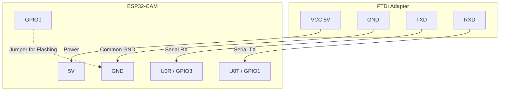

# Hardware and Network Setup Guide

This document outlines the wiring, flashing, router configuration, and verification steps for setting up the ESP32-CAM CSI receiver.

## 1. Network Requirements

The firmware captures Wi-Fi Channel State Information (CSI) from 802.11n HT20 packets.
* **Frequency Band**: 2.4 GHz (ESP32 only supports 2.4 GHz).
* **Channel Bandwidth**: 20 MHz HT (High Throughput).
* **Subcarriers**: 64 raw subcarriers (52-56 usable subcarriers after removing DC, guard, and pilot tones).
* **Router Settings**: Set router to 2.4 GHz only, with bandwidth fixed at 20 MHz, on a stable channel (e.g., Channel 1, 6, or 11).

## 2. Wiring Diagram

To program the ESP32-CAM (AI Thinker board), a USB-UART adapter (e.g., FTDI, CP2102) is required. Note that GPIO0 must be tied to GND during boot to enter the ROM bootloader (flashing mode).



> [!WARNING]
> Ensure the FTDI VCC jumper is set to **5V**, as the ESP32-CAM's onboard voltage regulator requires 5V to run reliably (especially when Wi-Fi is active). If powered via 3.3V, brownouts may occur.

## 3. Flashing Procedure

1. Connect the ESP32-CAM to the FTDI adapter as shown above.
2. Short **GPIO0** to **GND** using a jumper wire.
3. Plug the FTDI adapter into the host USB port.
4. Press the **RST** button on the back of the ESP32-CAM board to enter flashing mode.
5. In your terminal, navigate to the `firmware/` directory and configure credentials:
   ```bash
   idf.py menuconfig
   ```
6. Build and flash the firmware:
   ```bash
   idf.py build
   idf.py -p <serial_port> flash monitor
   ```
   *(e.g., `<serial_port>` could be `COM3` on Windows or `/dev/ttyUSB0` on Linux).*
7. Once flashing is complete, **remove the GPIO0-to-GND jumper** and press **RST** again to boot the firmware in normal run mode.

## 4. Router Configuration

To ensure consistent CSI captures, configure your Wi-Fi router:
1. Log in to the router admin page.
2. Select the 2.4 GHz wireless network.
3. Configure the following parameters:
   - **Mode**: 802.11n only or 802.11b/g/n mixed.
   - **Channel**: Manual (choose a quiet channel, e.g., 6).
   - **Channel Width**: Fixed at 20 MHz (do **not** select Auto or 40 MHz).
   - **SSID & Password**: Match the settings entered in `menuconfig`.

## 5. "Known-Good" Verification Checklist

Complete the following steps to verify that the CSI receiver is working before proceeding:

- [ ] **Serial Output**: The Serial monitor (`idf.py monitor`) shows:
  ```
  Starting WiFiSense CSI Firmware (Camera disabled)
  wifi_init_sta completed. SSID: <your_configured_ssid>
  Got IP: 192.168.4.X
  CSI Configured successfully
  CSI Callback registered successfully
  ```
- [ ] **Wi-Fi Connectivity**: The ESP32-CAM successfully pings the router or host machine.
- [ ] **Watchdog Status**: No watchdog warning resets are triggered (i.e. callbacks fire at ≥10 Hz).
- [ ] **Network Output**: Verify that UDP packages are arriving at the host machine by running the following command on the host terminal:
  ```bash
  # Listen on UDP port 5566 (CSI packets)
  nc -ul 5566 | xxd
  ```
  You should see hex bytes arriving in quick succession.
- [ ] **Control Logs**: Verify that JSON logs are arriving on the control port (5567):
  ```bash
  nc -ul 5567
  ```
  Expected output:
  `{"timestamp_us":1054320,"level":"INFO","source":"WIFISENSE_NET","message":"Wi-Fi Connected and IP obtained"}`
