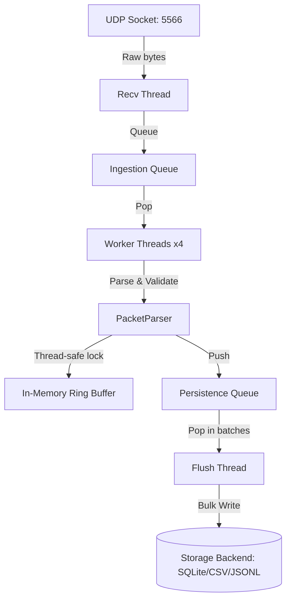

# WiFiSense Python Receiver

This directory contains the Python-side UDP receiver ingestion service for capturing, parsing, validating, buffering, and persisting raw Channel State Information (CSI) packets sent from the ESP32-CAM firmware.

## Architecture

The service uses a high-performance, multi-threaded pipeline:



- **RecvThread**: Captures UDP datagrams off the socket and places them on the queue quickly to avoid socket buffer overrun.
- **WorkerThreads**: Multiple concurrent workers that pull raw data, run struct unpacking and semantic verification, and append items to the memory window.
- **FlushThread**: Runs at a periodic interval (e.g. 1 second) to extract all parsed packets and insert them to the active backend (CSV, JSONL, or SQLite database via SQLAlchemy bulk operations).
- **In-Memory Ring Buffer**: Implements a sliding window (`collections.deque`) representing the last N seconds of data, allowing other local modules (e.g., signal filtering) to fetch window snapshots rapidly.

## Configuration

Configurations are loaded from `config.yaml`:
```yaml
server:
  host: "0.0.0.0"
  port: 5566
  control_port: 5567

pipeline:
  worker_threads: 4
  max_queue_size: 10000
  flush_interval_ms: 1000
  batch_size: 500

buffer:
  window_seconds: 10
  expected_hz: 50

storage:
  backend: "sqlite"  # 'sqlite', 'csv', 'jsonl'
```

## Running Standalone

To run the receiver independently:
```bash
python -m python_receiver.udp_server
```
